# SIMKESGI System Flowchart - Mermaid Code
# Sistem Informasi Kesehatan Gigi
# Poltekkes Kemenkes Palembang

---

## 1. SYSTEM OVERVIEW - Alur Kerja Sistem SIMKESGI

```mermaid
flowchart TD
    Start([START - Akses Sistem]) --> Login[Login Authentication]
    Login --> |Validasi Email & Password| Role{User Role?}
    
    Role --> Admin[👤 Admin<br/>Management]
    Role --> Mahasiswa[👨‍🎓 Mahasiswa<br/>Data Entry]
    Role --> Pembimbing[👨‍⚕️ Pembimbing<br/>Supervisor]
    
    Admin --> Dashboard[Dashboard<br/>Statistik & Monitoring]
    Mahasiswa --> Dashboard
    Pembimbing --> Dashboard
    
    Dashboard --> Modul[Modul Utama 15+<br/>━━━━━━━━━━━<br/>• Kartu Pasien<br/>• Anamnesa<br/>• Pemeriksaan<br/>• Odontogram<br/>• OHI-S<br/>• Vitalitas<br/>• Diagnosa<br/>• Perencanaan<br/>• Pelaksanaan]
    
    Modul --> DB[(MySQL Database<br/>Data Storage)]
    
    DB --> Approval[Approval Workflow<br/>ACC dengan TTE]
    Approval --> |Tanda Tangan Elektronik| Output[/Output: Rekam Medis<br/>Print & Export PDF/]
    
    Output --> End([END - Logout])
    
    style Start fill:#10b981,stroke:#059669,color:#fff
    style End fill:#1e40af,stroke:#1e3a8a,color:#fff
    style Login fill:#dbeafe,stroke:#3b82f6,color:#1e40af
    style Role fill:#fde68a,stroke:#fbbf24,color:#92400e
    style Admin fill:#e9d5ff,stroke:#a855f7,color:#6b21a8
    style Mahasiswa fill:#e9d5ff,stroke:#a855f7,color:#6b21a8
    style Pembimbing fill:#e9d5ff,stroke:#a855f7,color:#6b21a8
    style Dashboard fill:#dbeafe,stroke:#3b82f6,color:#1e40af
    style Modul fill:#dbeafe,stroke:#3b82f6,color:#1e40af
    style DB fill:#dcfce7,stroke:#059669,color:#059669
    style Approval fill:#dbeafe,stroke:#3b82f6,color:#1e40af
    style Output fill:#fbcfe8,stroke:#ec4899,color:#9f1239
```



---

## 2. USER FLOW - Alur Kerja Berdasarkan Role

```mermaid
flowchart TD
    Start([User Login]) --> Identify{Identifikasi Role}
    
    %% MAHASISWA FLOW
    Identify --> |Mahasiswa| M1[Pilih Pasien]
    M1 --> M2[Input Data Pasien<br/>Kartu Pasien + Anamnesa]
    M2 --> M3[Pemeriksaan Lengkap<br/>Odontogram, OHI-S, Vitalitas]
    M3 --> M4[Input Diagnosa<br/>& Perencanaan]
    M4 --> M5[Catat Pelaksanaan<br/>Tindakan]
    M5 --> M6[/Submit untuk ACC<br/>ke Pembimbing/]
    
    %% PEMBIMBING FLOW
    Identify --> |Pembimbing| P1[Review Data<br/>Mahasiswa]
    P1 --> P2{Data Valid?}
    P2 --> |❌ Tidak| P3[REJECT<br/>Revisi oleh Mahasiswa]
    P2 --> |✅ Ya| P4[APPROVE ACC<br/>+ TTE Digital]
    P3 --> P1
    P4 --> P5[/Rekam Medis Final<br/>Siap Print\/Export/]
    
    %% ADMIN FLOW
    Identify --> |Admin| A1[Manajemen User<br/>Admin, Mahasiswa, Pembimbing]
    A1 --> A2[Manajemen Data Master<br/>Diagnosa, Penyebab, Gejala]
    A2 --> A3[Monitoring Sistem<br/>Dashboard & Analytics]
    A3 --> A4[(Backup &<br/>Maintenance Data)]
    
    M6 --> End1([Process Complete])
    P5 --> End2([Process Complete])
    A4 --> End3([Process Complete])
    
    style Start fill:#10b981,stroke:#059669,color:#fff
    style End1 fill:#1e40af,stroke:#1e3a8a,color:#fff
    style End2 fill:#1e40af,stroke:#1e3a8a,color:#fff
    style End3 fill:#1e40af,stroke:#1e3a8a,color:#fff
    style Identify fill:#fde68a,stroke:#fbbf24,color:#92400e
    style P2 fill:#fde68a,stroke:#fbbf24,color:#92400e
    style M1 fill:#dbeafe,stroke:#3b82f6,color:#1e40af
    style M2 fill:#dbeafe,stroke:#3b82f6,color:#1e40af
    style M3 fill:#dbeafe,stroke:#3b82f6,color:#1e40af
    style M4 fill:#dbeafe,stroke:#3b82f6,color:#1e40af
    style M5 fill:#dbeafe,stroke:#3b82f6,color:#1e40af
    style M6 fill:#fbcfe8,stroke:#ec4899,color:#9f1239
    style P1 fill:#dbeafe,stroke:#3b82f6,color:#1e40af
    style P3 fill:#fee2e2,stroke:#dc2626,color:#dc2626
    style P4 fill:#dcfce7,stroke:#059669,color:#059669
    style P5 fill:#fbcfe8,stroke:#ec4899,color:#9f1239
    style A1 fill:#dbeafe,stroke:#3b82f6,color:#1e40af
    style A2 fill:#dbeafe,stroke:#3b82f6,color:#1e40af
    style A3 fill:#dbeafe,stroke:#3b82f6,color:#1e40af
    style A4 fill:#dcfce7,stroke:#059669,color:#059669
```



---

## 3. DATA FLOW - Alur Pergerakan Data dalam Sistem

```mermaid
flowchart TD
    Start([Data Entry Point]) --> Input[/Input Layer<br/>Form Validation & Sanitization/]
    Input --> |Laravel Validation Rules| Controller[Controller Layer<br/>Business Logic Processing]
    
    Controller --> |Laravel Controllers| Model[Model Layer<br/>Data Mapping & ORM]
    
    Model --> |Eloquent ORM| DB[(MySQL 8.0<br/>━━━━━━━━━━━<br/>📊 Database Tables:<br/>• users<br/>• kartu_pasien<br/>• anamnesa<br/>• odontogram<br/>• ohi_s<br/>• vitalitas<br/>• diagnosa<br/>• perencanaan<br/>• pelaksanaan)]
    
    DB --> View[View Layer<br/>Blade Templates Rendering]
    View --> |Frontend Display| Output[/Output to User<br/>HTML, PDF, Export/]
    
    Output --> End([Data Delivery Complete])
    
    style Start fill:#10b981,stroke:#059669,color:#fff
    style End fill:#1e40af,stroke:#1e3a8a,color:#fff
    style Input fill:#fbcfe8,stroke:#ec4899,color:#9f1239
    style Controller fill:#dbeafe,stroke:#3b82f6,color:#1e40af
    style Model fill:#dbeafe,stroke:#3b82f6,color:#1e40af
    style DB fill:#dcfce7,stroke:#059669,color:#059669
    style View fill:#dbeafe,stroke:#3b82f6,color:#1e40af
    style Output fill:#fbcfe8,stroke:#ec4899,color:#9f1239
```



---

## 4. WORKFLOW PROCESS - Proses Rekam Medis Lengkap

```mermaid
flowchart TD
    Start([Pasien Baru Datang]) --> T1[📝 TAHAP 1<br/>Identifikasi Pasien<br/>━━━━━━━━━━━<br/>No. Kartu, Nama, NIK<br/>Data Demografis]
    
    T1 --> T2[📋 TAHAP 2<br/>Anamnesa & Riwayat<br/>━━━━━━━━━━━<br/>Keluhan, Riwayat Penyakit<br/>Alergi, Vital Sign]
    
    T2 --> T3[🔍 TAHAP 3<br/>Pemeriksaan Awal<br/>━━━━━━━━━━━<br/>Eksternal Oral<br/>Plak & Kalkulus, OHI-S]
    T3 --> |Auto-Calculate<br/>Plaque Score, OHI-S Index| T4
    
    T4[🦷 TAHAP 4<br/>Odontogram Digital<br/>━━━━━━━━━━━<br/>Status setiap gigi<br/>Kondisi karies]
    T4 --> |Auto-Calculate<br/>DMF-T, def-t Score| Karies{Ada Gigi<br/>Karies?}
    
    Karies --> |✅ Ya| T5A[🔬 TAHAP 5<br/>Pemeriksaan Lanjutan<br/>━━━━━━━━━━━<br/>Tes Vitalitas<br/>Periodontal<br/>Anomali Mukosa]
    Karies --> |❌ Tidak| T5B[Skip Vitalitas<br/>Langsung ke Diagnosa]
    
    T5A --> |Auto-Diagnosis<br/>KME, KMD, KMP| T6
    T5B --> T6
    
    T6[💉 TAHAP 6<br/>Diagnosa Askepgilut<br/>━━━━━━━━━━━<br/>Diagnosis, Penyebab, Gejala]
    
    T6 --> T7[📝 TAHAP 7<br/>Perencanaan Perawatan<br/>━━━━━━━━━━━<br/>Rasional, Tujuan<br/>Indikator, Evaluasi]
    
    T7 --> T8[✅ TAHAP 8<br/>Pelaksanaan Tindakan<br/>━━━━━━━━━━━<br/>Intervensi, Hasil<br/>Rencana Tindak Lanjut]
    
    T8 --> Submit[/Submit ke Pembimbing<br/>Menunggu ACC/]
    Submit --> ACC{ACC oleh<br/>Pembimbing?}
    
    ACC --> |❌ Ditolak| Revisi[Revisi oleh Mahasiswa]
    ACC --> |✅ Disetujui| Approved[TTE Pembimbing<br/>Ditambahkan]
    
    Revisi --> T6
    Approved --> Final[/🖨️ Rekam Medis Final<br/>Print\/Export PDF/]
    
    Final --> End([Proses Selesai])
    
    style Start fill:#10b981,stroke:#059669,color:#fff
    style End fill:#1e40af,stroke:#1e3a8a,color:#fff
    style T1 fill:#dbeafe,stroke:#3b82f6,color:#1e40af
    style T2 fill:#dbeafe,stroke:#3b82f6,color:#1e40af
    style T3 fill:#dbeafe,stroke:#3b82f6,color:#1e40af
    style T4 fill:#dbeafe,stroke:#3b82f6,color:#1e40af
    style T5A fill:#dbeafe,stroke:#3b82f6,color:#1e40af
    style T5B fill:#dbeafe,stroke:#3b82f6,color:#1e40af
    style T6 fill:#dbeafe,stroke:#3b82f6,color:#1e40af
    style T7 fill:#dbeafe,stroke:#3b82f6,color:#1e40af
    style T8 fill:#dbeafe,stroke:#3b82f6,color:#1e40af
    style Karies fill:#fde68a,stroke:#fbbf24,color:#92400e
    style ACC fill:#fde68a,stroke:#fbbf24,color:#92400e
    style Submit fill:#fbcfe8,stroke:#ec4899,color:#9f1239
    style Revisi fill:#fee2e2,stroke:#dc2626,color:#dc2626
    style Approved fill:#dcfce7,stroke:#059669,color:#059669
    style Final fill:#fbcfe8,stroke:#ec4899,color:#9f1239
```



---

## 5. SYSTEM ARCHITECTURE - Arsitektur Teknologi (Simplified)

```mermaid
flowchart TD
    subgraph Presentation["🎨 PRESENTATION LAYER"]
        HTML[HTML5<br/>Semantic Markup]
        CSS[CSS3/Bootstrap 5<br/>Responsive UI]
        JS[JavaScript<br/>Client Logic]
        Blade[Blade Templates<br/>View Rendering]
    end
    
    subgraph Application["⚙️ APPLICATION LAYER"]
        Laravel[Laravel 10.x<br/>MVC Framework]
        Controllers[Controllers<br/>Business Logic]
        Models[Models<br/>Data Entities]
        Middleware[Middleware<br/>Authentication]
    end
    
    subgraph Business["🧮 BUSINESS LOGIC LAYER"]
        AutoCalc[Auto-Calculate<br/>OHI-S, DMF-T, def-t]
        Validation[Validation Rules<br/>Form & Data]
        Workflow[Workflow Engine<br/>ACC & Approval]
        PDF[PDF Generation<br/>Report Export]
    end
    
    subgraph DataAccess["💾 DATA ACCESS LAYER"]
        Eloquent[Eloquent ORM<br/>Object-Relational Mapping]
        QueryBuilder[Query Builder<br/>Database Queries]
        Migrations[Migrations<br/>Schema Management]
    end
    
    subgraph Database["🗄️ DATABASE LAYER"]
        MySQL[(MySQL 8.0<br/>Relational Storage<br/>━━━━━━━━━━━<br/>15+ Tables<br/>Foreign Keys<br/>Indexes)]
    end
    
    subgraph Infrastructure["🖥️ INFRASTRUCTURE LAYER"]
        WebServer[Apache/Nginx<br/>Web Server]
        PHP[PHP 8.1+<br/>Runtime]
        Composer[Composer<br/>Dependencies]
        Linux[Linux Server<br/>Ubuntu/CentOS]
    end
    
    Presentation --> Application
    Application --> Business
    Business --> DataAccess
    DataAccess --> Database
    Database --> Infrastructure
    
    style Presentation fill:#dbeafe,stroke:#3b82f6,color:#1e40af
    style Application fill:#dcfce7,stroke:#059669,color:#059669
    style Business fill:#fde68a,stroke:#fbbf24,color:#92400e
    style DataAccess fill:#fbcfe8,stroke:#ec4899,color:#9f1239
    style Database fill:#e9d5ff,stroke:#a855f7,color:#6b21a8
    style Infrastructure fill:#f3f4f6,stroke:#6b7280,color:#1f2937
```



---

## 6. DATABASE SCHEMA - Relasi Tabel Utama


---

## 7. AUTHENTICATION FLOW - Alur Autentikasi & Autorisasi

```mermaid
flowchart TD
    Start([User Access]) --> LoginPage[Login Page]
    LoginPage --> Input[/Input Email & Password/]
    Input --> Validate{Credentials<br/>Valid?}
    
    Validate --> |❌ Invalid| Error[Error Message<br/>Login Failed]
    Error --> LoginPage
    
    Validate --> |✅ Valid| Session[Create Session<br/>Generate Token]
    Session --> CheckRole{Check<br/>User Role}
    
    CheckRole --> |Admin| AdminDash[Admin Dashboard<br/>━━━━━━━━━━━<br/>• User Management<br/>• Data Master<br/>• System Monitoring]
    CheckRole --> |Mahasiswa| MhsDash[Mahasiswa Dashboard<br/>━━━━━━━━━━━<br/>• Patient Data Entry<br/>• Submit for ACC<br/>• View Reports]
    CheckRole --> |Pembimbing| PbmDash[Pembimbing Dashboard<br/>━━━━━━━━━━━<br/>• Review Student Data<br/>• ACC Approval<br/>• Digital Signature]
    
    AdminDash --> Access[Access Granted<br/>Full Features]
    MhsDash --> Access
    PbmDash --> Access
    
    Access --> Logout{User<br/>Logout?}
    Logout --> |No| Access
    Logout --> |Yes| Destroy[Destroy Session<br/>Clear Token]
    Destroy --> End([Logout Success])
    
    style Start fill:#10b981,stroke:#059669,color:#fff
    style End fill:#1e40af,stroke:#1e3a8a,color:#fff
    style LoginPage fill:#dbeafe,stroke:#3b82f6,color:#1e40af
    style Input fill:#fbcfe8,stroke:#ec4899,color:#9f1239
    style Validate fill:#fde68a,stroke:#fbbf24,color:#92400e
    style CheckRole fill:#fde68a,stroke:#fbbf24,color:#92400e
    style Logout fill:#fde68a,stroke:#fbbf24,color:#92400e
    style Error fill:#fee2e2,stroke:#dc2626,color:#dc2626
    style Session fill:#dbeafe,stroke:#3b82f6,color:#1e40af
    style AdminDash fill:#e9d5ff,stroke:#a855f7,color:#6b21a8
    style MhsDash fill:#e9d5ff,stroke:#a855f7,color:#6b21a8
    style PbmDash fill:#e9d5ff,stroke:#a855f7,color:#6b21a8
    style Access fill:#dcfce7,stroke:#059669,color:#059669
    style Destroy fill:#dbeafe,stroke:#3b82f6,color:#1e40af
```



---

## 8. APPROVAL WORKFLOW - Alur Persetujuan Data


---

## CARA PENGGUNAAN MERMAID CODE:

### 1. **GitHub/GitLab**
Copy code di atas dan paste ke README.md atau file .md lainnya.
Code block harus dimulai dengan:
````markdown
```mermaid
[code di sini]
```
````

### 2. **Mermaid Live Editor**
- Buka: https://mermaid.live/
- Paste code untuk edit & preview
- Export sebagai SVG/PNG

### 3. **Notion**
- Ketik `/code`
- Pilih "Mermaid"
- Paste code

### 4. **Obsidian**
- Install plugin "Mermaid"
- Buat code block dengan ```mermaid

### 5. **VS Code**
- Install extension "Markdown Preview Mermaid Support"
- Preview file .md

### 6. **Confluence/Jira**
- Install "Mermaid for Confluence" app
- Insert diagram dengan mermaid code

---

**Tech Stack:** Laravel 10 • PHP 8.1+ • MySQL 8.0 • Bootstrap 5
**Created for:** SIMKESGI - Poltekkes Kemenkes Palembang
**Version:** 1.0.0
**Last Updated:** 2025

---
